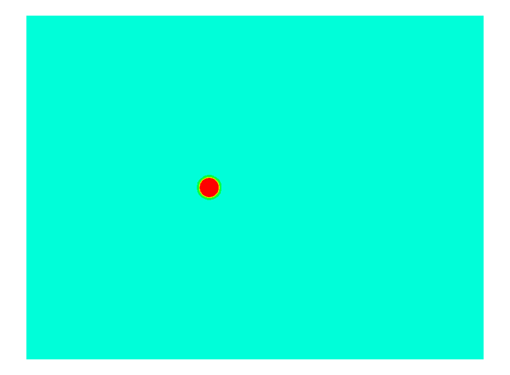

# NGSTrefftz
**an add-on to NGSolve for Trefftz methods**

[](https://mybinder.org/v2/gh/PaulSt/NGSTrefftz/HEAD?filepath=doc%2Fnotebooks%2Findex.ipynb)
[](https://hub.docker.com/r/paulstdocker/ngstrefftz)
[](https://pypi.org/project/ngstrefftz/)
[](https://github.com/PaulSt/NGSTrefftz/actions)
[](https://joss.theoj.org/papers/c2f4e85b118c22b81aa27d7799265409)
[](https://paulst.github.io/NGSTrefftz/)

NGSTrefftz provides a framework to implement Trefftz finite element spaces for [NGSolve](https://www.ngsolve.com), with several Trefftz spaces already implemented. Additionally, Trefftz-DG on tent-pitched meshes for the acoustic wave equation is implemented using meshes provided by [ngstents](https://github.com/jayggg/ngstents). Furthermore, the package includes an implementation of the embedded Trefftz method.

## Try it out!
You can try out some jupyter notebooks:
* Launch the Binder here:   
  [](https://mybinder.org/v2/gh/PaulSt/NGSTrefftz/HEAD?filepath=doc%2Fnotebooks%2Findex.ipynb)
* Or run the docker locally (you need to have docker installed):

```bash
git clone https://github.com/PaulSt/NGSTrefftz
cd NGSTrefftz && docker build -t ngstrefftz_jupyter .
docker run -p 8888:8888 ngstrefftz_jupyter
```

## Installing the package
You can either:
 * install using pip

```bash
pip install ngstrefftz
```

 * or build from source

```bash
git clone --recursive https://github.com/PaulSt/NGSTrefftz
mkdir ./NGSTrefftz/make && cd ./NGSTrefftz/make
cmake ../src && make install
```

#### Dependencies
You need to have [NGSolve](https://www.ngsolve.com/) installed. To build the package you need
 * cmake  >= 3.1
 * gcc >= 9 or clang >= 10
 * ngsolve >= 6.2

To access the newest features the nightly version of NGSolve works best and lapack >= 3.9 is required.

## News
Feb, 2022: If you are using NGSolve nightly releases: [NGSolve@eda758d](https://github.com/NGSolve/ngsolve/commit/eda758d99483888851913d8a5c9aff4d0cbc9cc2) breaks a dependency and [NGSolve@3d52ecd](https://github.com/NGSolve/ngsolve/commit/3d52ecd615f2b7c409219eebaba99288ea19c1bc) produces import issue. Make sure to update ngstrefftz submodules and move to newest ngsolve version, at least [NGSolve@5839a09](https://github.com/NGSolve/ngsolve/commit/5839a09810235a938bd85807d8e638d3a0b6c69d).

Jan, 2022: NGSTrefftz is now available via pip! 🚀

Nov, 2021: NGSTrefftz now comes in a docker and with binder notebooks! 🚀

#### Papers using the code
* Tent pitching and Trefftz-DG method for the acoustic wave equation  
[](https://arxiv.org/abs/1907.02367)
* A space-time quasi-Trefftz DG method for the wave equation with piecewise-smooth coefficients  
[](https://arxiv.org/abs/2011.04617)
* Embedded Trefftz discontinuous Galerkin methods  
[](https://arxiv.org/abs/2201.07041)




